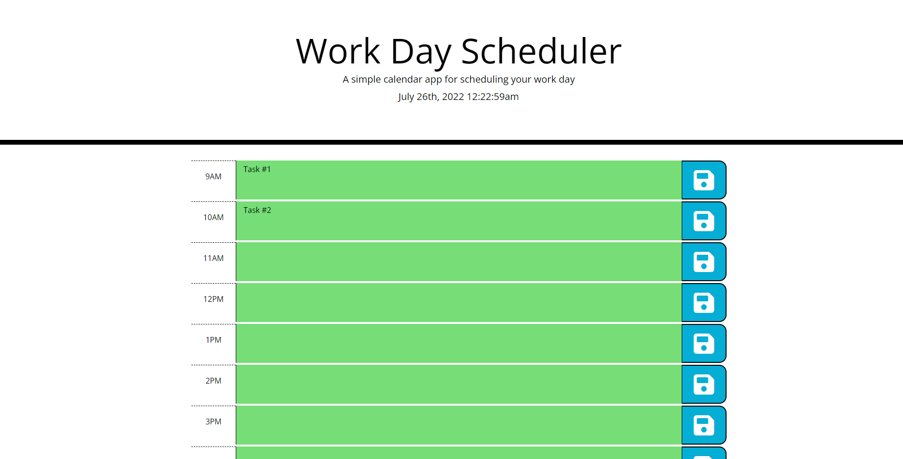

# Work Day Scheduler

## Author
Gustavo Higuera
* GitHub: https://github.com/Gustavo-Higuera
* LinkedIn: https://www.linkedin.com/in/gustavo-higuera-80322315b/

## Description

In this project, I created a work-day scheduler application. The user is presented with time blocks ranging from 9am to 5pm. Each time block is color coded to whether it is in the past, present or future. The user can enter a task in the time block, and save the task into the local storage of the web page. This will keep the tasks from deleting when the user refreshes the page, or exits. 

## Links

Here is a link to the deployed GitHub page:
https://gustavo-higuera.github.io/work-day-scheduler/

Here is a link to the repository:
https://github.com/Gustavo-Higuera/work-day-scheduler

## Languages Used
- HTML
- CSS
- JavaScript
- JQuery

## Photo of the Application

